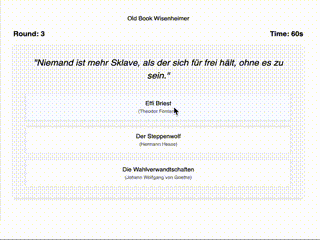

# Old Book Wisenheimer (SDD)

A simple literature quiz about quotes and books.

Built using an approach of Specification Driven Development (SDD).
The approach is outlined in [0_Meta/definitions.md](0_Meta/definitions.md).

Main ideas: 
- define terms like "Vision", "Product", "System", etc. and relations between those terms
- use these terms in directory and file names, prompts, etc.
- support iterative development, e.g., a Product Design moves towards the Product Vision in Story increments 

Inspirations:
- [How to Use a Spec-Driven Approach for Coding with AI](https://blog.jetbrains.com/junie/2025/10/how-to-use-a-spec-driven-approach-for-coding-with-ai/)
- [Understanding Spec-Driven-Development: Kiro, spec-kit, and Tessl](https://martinfowler.com/articles/exploring-gen-ai/sdd-3-tools.html)
- [Specification-Driven Development (SDD)](https://github.com/github/spec-kit/blob/main/spec-driven.md)

## Devlogs

Coming Soon ...

## Status

Works locally with mocked Quote Questions.
So [4_Stories/story-0-mlp/story-0-mlp.md](4_Stories/story-0-mlp/story-0-mlp.md), 
a Minimum Lovable Product (MLP) is almost finished (Deployment is still missing).

## Backend

`cd 3_Implementation && ./gradlew :obwh-backend:bootRun`

## Frontend

`cd 3_Implementation/obwh-frontend && npm run start`

Then open http://localhost:4200/

## ⚠️ License Notice

This project is licensed under the **Creative Commons Attribution-NonCommercial 4.0 International (CC BY-NC 4.0)** Public License.

**This means:**
* You are free to view, share, and adapt the code.
* You must give appropriate credit to the original author (Attribution).
* **Use for commercial purposes is strictly prohibited.**

For the full legal text, please visit the official license page:
[Creative Commons BY-NC 4.0](https://creativecommons.org/licenses/by-nc/4.0/)
